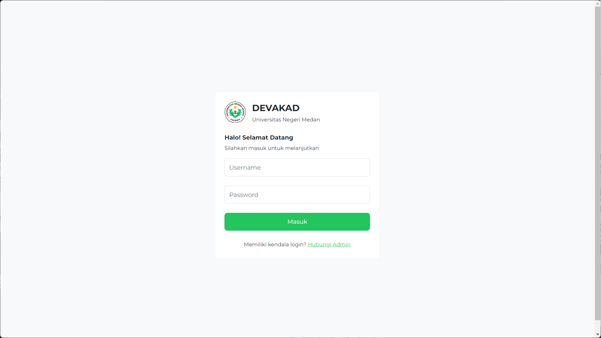
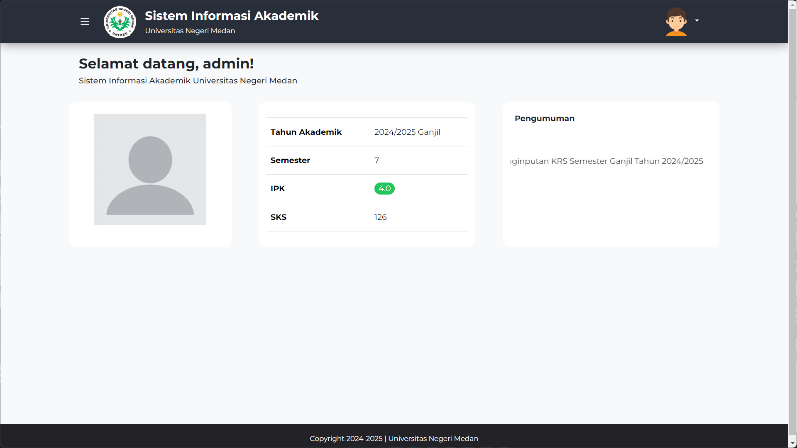
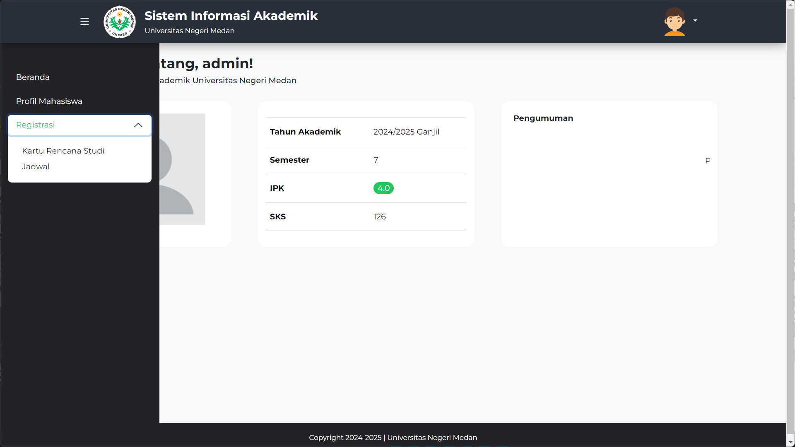
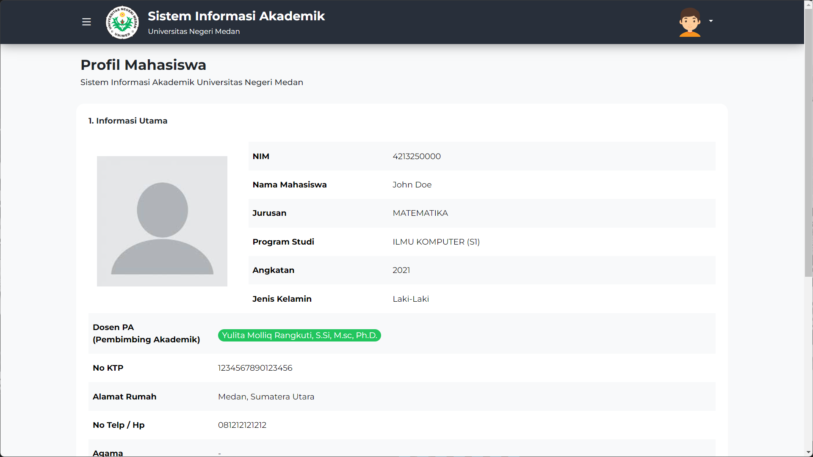

# Simple Academic System Website for Universitas Negeri Medan using Bootstrap 5
This project is a simple web-based academic system interface for Universitas Negeri Medan, built using Bootstrap 5 for responsive and modern design. The goal is to provide a clean and user-friendly interface for managing academic data efficiently.

### Screenshots:

#### 1. Login Page

#### 2. Dashboard

#### 3. Sidebar

#### 4. Student Profile

